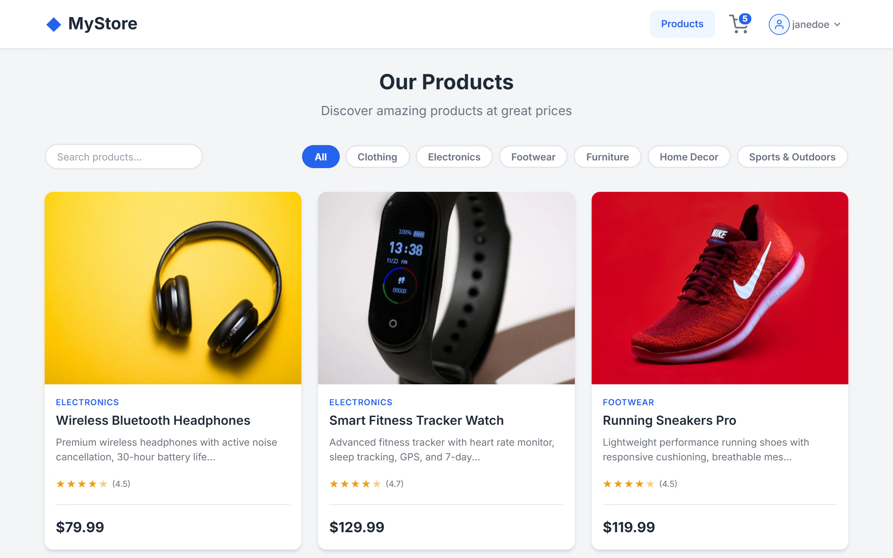
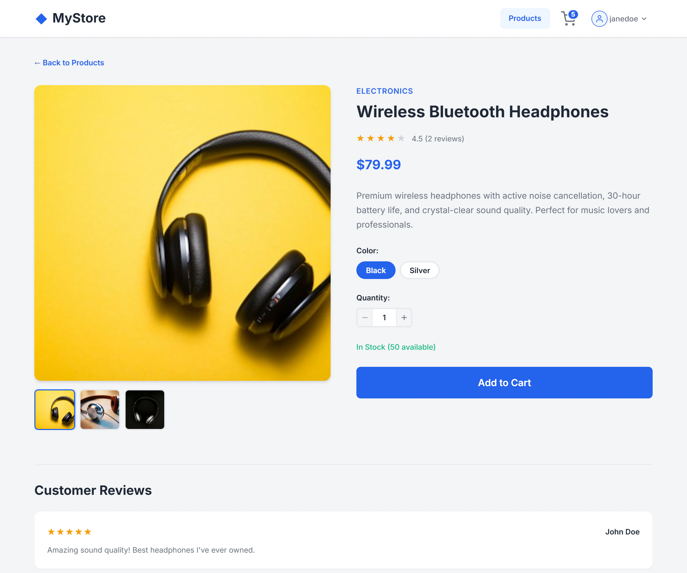
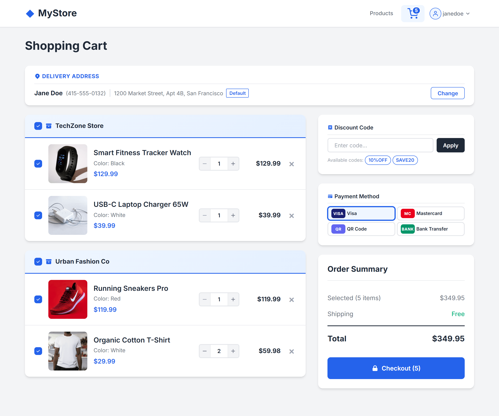

# MyStore — Full-Stack E-Commerce App



| Product details | Shopping cart |
| --------------- | ------------- |
|  |  |

An e-commerce single-page application built with **Angular 18** and backed by a **Node/Express + PostgreSQL** REST API. Users can register and log in, browse a product catalog, view product details, add items to a shopping cart, manage quantities, and complete a checkout flow with an order confirmation page.

## Features

- **Product catalog** — browse, search, and filter products by category
- **Product details** — view photos, name, price, description, colour options, stock info, and customer reviews
- **Shopping cart** — add/remove items, update quantities, see per-item subtotals and a total cost
- **Checkout** — pick the items to buy, a shipping address and a payment method, apply discount codes, and place an order. The server charges the cart rows it is given: quantities from the cart, prices and stock from the product, stock reduced, and the price paid stored on each order line
- **Order confirmation** — success page displayed after checkout
- **User authentication** — register, log in, log out. The access token lives in memory and the session in an HttpOnly cookie, so a script on the page cannot steal it
- **Guest entry** — opening the site signs the visitor in to a shared demo account, so the store is there to walk through without registering. Signing out brings the login and register forms back for the rest of that tab
- **Admin role** — `customer` / `admin`; admins get an `/admin` API for every account, the catalog, orders, carts and addresses (see [app/backend/SECURITY.md](app/backend/SECURITY.md) for the OWASP API Top 10 mapping)
- **Activity log** — writes, logins, failed logins, logouts and admin reads of account data are recorded with who, when, the route and the result; admins browse them with filters for user, type, result and dates
- **Page views** — the pages people open are kept separately, on their own admin page
- **Cart badge** — navbar shows the current item count; empty-cart state when no items are present
- **Form validation** — required fields, minimum lengths, password confirmation match
- **Toast notifications** — user feedback on every cart/auth/checkout action

## Prerequisites

- **Node.js** v22+
- **Docker** (or a local PostgreSQL 17 instance)
- **Angular CLI** v18 — `npm install -g @angular/cli`

## Installation & Launch

### 1. Backend

```bash
cd app/backend
npm install
docker compose up -d          # starts PostgreSQL on 127.0.0.1:5432
cp .env.example .env          # then fill in TOKEN_SECRET and PASSWORD_PEPPER
npm run migrate:up            # creates database tables
npm run seed:admin            # creates the admin account from ADMIN_USERNAME / ADMIN_PASSWORD in .env
npm run seed:demo             # creates the shared demo customer that guest entry signs visitors in to
npm run watch                 # starts the API at http://localhost:3000
```

> `.env.example` ships without secrets on purpose: the server refuses to start until `TOKEN_SECRET`
> and `PASSWORD_PEPPER` are set (32+ characters each). Generate one with
> `node -e "console.log(require('crypto').randomBytes(48).toString('base64url'))"`.

### 2. Frontend

```bash
cd app/frontend
npm install
ng serve                      # starts the app at http://localhost:4200
```

**Both backend and frontend must be running at the same time.** The frontend fetches all product and cart data from the backend API at `http://localhost:3000`.

### Guest entry

Opening `http://localhost:4200` signs the visitor in to the shared demo account and drops them
straight on the catalog — no form to fill in first. Signing out returns the login and register
forms and keeps them for the rest of that tab, refreshes included; a newly opened tab starts as a
guest again.

Switch it off per build with `autoDemoLogin: false` in `src/environments/environment*.ts`
(the login page then drops its **Browse as a guest** button), or server-side with
`DEMO_LOGIN_ENABLED=false`. Everyone who enters this way shares one customer account, so treat its
cart and orders as public.

## Tests

```bash
# Backend: lint, types and the API suite (resets the test database first)
cd app/backend
npm run lint && npm run typecheck && npm test

# Frontend tests (Karma + Jasmine)
cd app/frontend
ng test
```

The backend suite also runs in CI on every push — see [.github/workflows/backend.yml](.github/workflows/backend.yml).

## Project Structure

```
├── app/
│   ├── backend/              # Node/Express REST API + PostgreSQL
│   │   ├── src/
│   │   │   ├── app.ts        # Express app assembly (server.ts listens, cleans up daily, shuts down gracefully)
│   │   │   ├── config.ts     # The environment, validated once at startup
│   │   │   ├── logger.ts     # Structured logs, one request id per request
│   │   │   ├── routes/       # URL + middleware per domain, mounted under /api/v1
│   │   │   ├── controllers/  # Parse the request with a schema, call a service, answer
│   │   │   ├── schemas/      # zod schemas: every request body, query and parameter
│   │   │   ├── services/     # The business rules: checkout, sessions, passwords, activity
│   │   │   ├── repositories/ # One class per table: parameterized SQL + row mapping
│   │   │   ├── middleware/   # JWT auth, admin role check, audit log, rate limits
│   │   │   ├── utils/        # Response envelope, error handler, schema parsing, refresh cookie
│   │   │   ├── scripts/      # seed:admin bootstrap
│   │   │   └── types/        # TypeScript interfaces
│   │   └── migrations/       # Database migration files
│   │
│   └── frontend/             # Angular 18 SPA
│       └── src/app/
│           ├── core/         # Guards, interceptors, services (auth, cart, UI), models
│           ├── features/
│           │   ├── auth/     # Login & Register (lazy-loaded)
│           │   ├── products/ # Product list & detail (lazy-loaded)
│           │   ├── cart/     # Cart page & order confirmation (lazy-loaded)
│           │   └── admin/    # Activity Log and Page views (lazy-loaded)
│           └── shared/       # Navbar, loading spinner, confirm dialog, form controls, pipes
└── docs/                     # Dependency reference, README screenshots
```

## Detailed Documentation

- [docs/app-dependencies.md](docs/app-dependencies.md) — Runtime and development dependency reference
- [app/frontend/README.md](app/frontend/README.md) — Angular project structure, features, and key patterns
- [app/backend/README.md](app/backend/README.md) — API routes, environment variables, and database scripts
